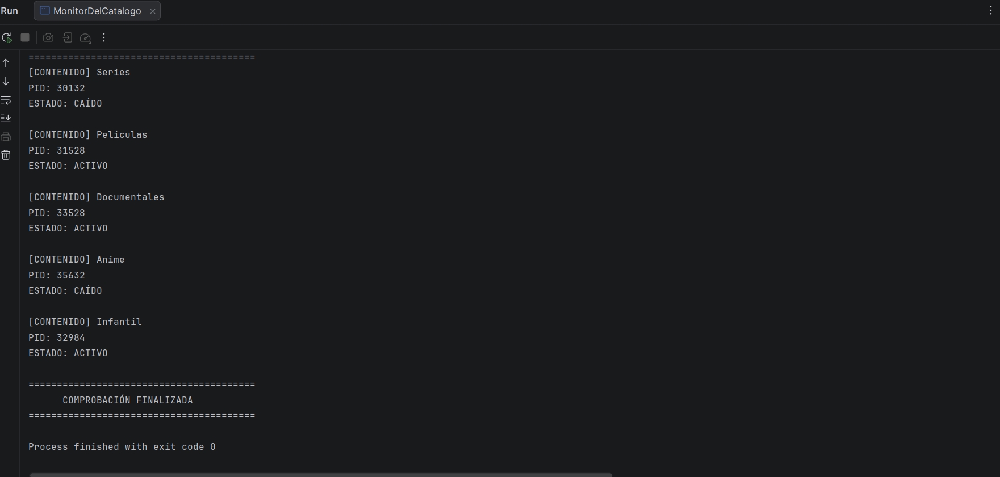

Reto 1 · Monitor del catálogo de UDITflix
Módulo: 0490 · Programación de Servicios y Procesos Autor/a: Marcelo Gonzalez (tu nombre) Reto: (marca el tuyo) ☐ Reto A (vídeos) · este☐ Reto B (contenidos) Tecnología: Java + ProcessBuilder (procesos del sistema operativo) RA vinculado: RA1 · Programación de aplicaciones compuestas por varios procesos

💡 Cómo usar este README: no es un trámite que se rellena al final. Es tu cuaderno de pensamiento durante el reto. Las secciones marcadas con 🧠 sirven para que pienses sobre cómo estás pensando. Si las rellenas de golpe en el último minuto, pierden todo su valor (y se nota).

📺 Qué es esta app
Un programa de consola que simula el monitor interno de UDITflix: comprueba si cada elemento del catálogo (vídeos o contenidos) está ACTIVO o CAÍDO. Para cada uno lanza un proceso externo (ping), muestra su PID, lee lo que responde y espera a que termine.

Sustituye la captura de abajo por la de tu propia ejecución antes de entregar.

🧠 Antes de empezar: planifico (5 min, sin tocar el teclado)
Responde antes de escribir una sola línea de código. No importa si te equivocas: lo importante es dejar escrito qué pensabas.

Con mis palabras, ¿qué me pide el reto? (sin copiar el enunciado) (escribe aquí) un programa que compruebe contenidos de uditflix, ver su PID y leer si esta activo o no

¿Qué parte de la píldora de clase creo que voy a reutilizar? (escribe aquí) voy a reutilizar la parte de crear un proceso con ProcessBuilder, ejecutarlo con start(), leer su salida y esperar a que termine con waitFor().

¿Qué parte me da más respeto o no sé por dónde empezar? (escribe aquí) Lo que mas respeto me da es hacer correr el cpdigo con un for y con un array doble

Mi plan en 3-4 pasos, en orden: (escribe aqui)
Crear una matriz con los nombres y las direcciones.
Recorrer la matriz con un for.
Crear un ProcessBuilder para hacer ping a cada direccion.
Leer el resultado, esperar al proceso y mostrar si esta activo o caido

Predicción: si todas las direcciones fueran 127.0.0.1, ¿qué estado saldría en los cinco elementos? ¿Y si todas fueran direcciones inexistentes? (escribe aquí, y comprueba al final si acertaste) Todos saldrian acivos porque es una direccion disponible

🎯 Objetivo del reto
Partir de lo aprendido en la píldora (lanzar un proceso) y dar el salto a gestionar varios procesos con una estructura de datos y un bucle, aplicando: creación de procesos con ProcessBuilder, identificación por PID, lectura de su salida, espera con waitFor() e interpretación de su resultado.

🛠️ Componentes y conceptos utilizados
Rellena la columna "con mis palabras" sin mirar tus apuntes. Después compara con ellos y corrige en otro color o con un comentario. Esa diferencia es exactamente lo que aún no tienes del todo claro.

Componente / concepto	Para qué se usa en esta app	Con mis palabras
ProcessBuilder	Prepara la orden (ping ...) que se enviará al sistema operativo	/Prepara el comando que quiero ejecutar en este caso ping
start()	Lanza de verdad el proceso; devuelve un Process sin esperarle/ Ejecuta el procesoq que he preparado	
Process	Objeto con el que controlo el proceso que ya está en marcha	/ representa el proceso que se esta ejecutando
pid()	Número que identifica al proceso en el sistema operativo	/ numero que identifica el proceso
getInputStream()	Canal por el que recibo lo que escribe el proceso	/ me permite recibir lo que devuelve el proceso
BufferedReader + readLine()	Leer esa salida línea a línea	/ leer la respuesta linea por linea 
waitFor()	Bloquea mi programa hasta que el proceso termina y devuelve su código de salida	/ con esto el programa espera hasta que termina el proceso
Matriz String[][]	Guarda, para cada elemento, su nombre y su dirección de comprobación	/ guarda el contenido que yo le diga 
Bucle for	Repite el mismo proceso de comprobación para cada fila de la matriz	/ repite la comprobacion para todos los contenidos de la matriz
¿Qué contiene cada posición de mi matriz?

matriz[i][0] →  (completa) nombre del contenido
matriz[i][1] →  (completa) direccion que voy a comprobar
🚀 Cómo ejecutar el proyecto
Clonar o abrir el proyecto en IntelliJ IDEA. 
Esperar a que indexe el proyecto.
Ejecutar (▶) la clase principal.
⚠️ El comando ping usa -n en Windows y -c en Linux/Mac para el número de intentos. Indica aquí con qué sistema lo has probado: (escribe aquí)

🔍 Mientras programo: mi diario de decisiones
Cada vez que te atasques, cambies de idea o algo falle, anota una entrada. Tres líneas bastan. No se trata de quedar bien: se trata de que dentro de un mes puedas reconstruir cómo pensaste.

Qué intentaba mostrar activo o caido	Qué pasó realmente	 algunos estados no eran correctos Qué hice revise la salida que devolvia PING y como comprobarla / qué aprendí lo que hice
(ejemplo) Mostrar el estado de cada elemento	Todos salían ACTIVO, incluso los que debían estar caídos	Revisé qué devolvía waitFor() para una dirección inexistente y vi que...
Mi pregunta-brújula cuando me bloqueo:

¿Qué espero que haga esta línea? 
¿Qué está haciendo realmente? (imprimo valores para comprobarlo)
¿En qué punto exacto se separan las dos respuestas?
🧭 De la píldora al reto: cómo di el salto
La píldora lanzaba un proceso. El reto lanza cinco. Explica ese salto con tus palabras:

¿Qué tenía la píldora que ya no me sirve tal cual? (escribe aquí)
esta comprobaba solo un proceso en este tengo que hacer lo mismo pero a 5

¿Qué he tenido que añadir para repetirlo cinco veces? ¿Por qué esa estructura y no otra? (escribe aquí)
una matriz para guardar el contenido de los 5 al mismo tiempo y un for para recorrer cada uno

¿Qué parte del código es exactamente igual en todas las vueltas del bucle y qué parte cambia? (escribe aquí)
El código para crear y comprobar el proceso es prácticamente igual en cada vuelta. Lo que cambia es el nombre y la dirección que se obtienen de la matriz.

Si mañana UDITflix tuviera 500 elementos en lugar de 5, ¿qué tendría que cambiar en mi código? (escribe aquí)
Solo tendría que añadir los nuevos elementos a la matriz. El for los recorrería automáticamente porque utiliza el tamaño de la matriz.

🧠 Qué he aprendido
(Completar al terminar. Redacta con tus palabras, no con las del enunciado.)

Hilo vs. proceso: la diferencia entre ambos es...Un proceso es un programa que se está ejecutando de forma independiente. Un hilo es una parte de ejecución dentro de un proceso
PID: lo que representa y por qué cambia en cada ejecución es...El PID es el número que identifica un proceso en el sistema operativo. Cambia porque cada ejecución crea un proceso diferente.
start() vs. waitFor(): lanzar un proceso y esperarle son cosas distintas porque... start inicia el proceso mientras waitfor hace que mi programa espere hasta que ese proceso termine.
Código de salida: lo que significa que sea 0 o distinto de 0 es... un 0 es alfo correcto y si no es 0 es que hay algun error
Lo que mi programa decide sobre ACTIVO / CAÍDO se basa en... (¿es fiable? ¿en qué casos podría equivocarse?)
🐞 Dificultades y cómo las resolví
(Completar antes de entregar. Reúne lo más importante de tu diario de decisiones.) Mi programa comprueba la salida que devuelve ping. Si encuentra una respuesta con TTL, considera que el contenido está ACTIVO; si no recibe esa respuesta, lo considera CAIDO.

Dificultad 1:

Qué síntoma vi: el comando ping no funcionaba como esperaba
Cuál era la causa real: el comando utilizaba opciones diferentes dependiendo del sistema operativo
Cómo la encontré: revise el comandoque estaba ejecutando
Cómo evitaré que me vuelva a pasar: comprobare si estoy trabajando en windows
Dificultad 2: (opcional)

🪞 Autoevaluación
Marca con honestidad, no con optimismo. Nadie te califica esta sección: es para ti y para que el profesor sepa dónde ayudarte.

Puedo explicar a un compañero...	🔴 No	🟡 Más o menos	🟢 Sí 
Qué hace ProcessBuilder	☐	☐	☐ si
Qué hace start() y por qué no espera	☐	☐	☐ mas o menos
Qué representa el PID	☐	☐	☐ si
Para qué sirve getInputStream()	☐	☐	☐ mas o menos
Qué hace waitFor() y qué devuelve	☐	☐	☐ si
Qué hay en cada posición de la matriz	☐	☐	☐ si
Qué hace el for en mi programa	☐	☐	☐ si
Mi predicción del principio, ¿acerté? (escribe aquí y explica por qué sí o por qué no)
Sí. Los elementos con 127.0.0.1 aparecieron como ACTIVO y los que tenían una dirección inexistente aparecieron como CAÍDO.
Lo que haría diferente si empezara de nuevo: (escribe aquí) nada

Lo que todavía no tengo claro y quiero preguntar en clase: (escribe aquí) tengo todo claro
todavía quiero entender mejor la diferencia entre el código de salida de ping y el texto que devuelve por pantalla.

🤝 Declaración de autoría
Este reto no permite herramientas de generación de código mediante IA. Consulté únicamente: la píldora de clase, mis apuntes, la documentación de Java e IntelliJ IDEA.

☐ Confirmo que el código es mío y que puedo explicarlo línea a línea. si

📂 Estructura del proyecto
src/main/java/org/example/   → clase con el main (el monitor de UDITflix)
README.md                    → este documento
(Ajusta la estructura a la de tu proyecto.) 

🔗 Enlace
GitHub: (tu repositorio) https://github.com/marcelocoronado1509-oss/psp_udit-
